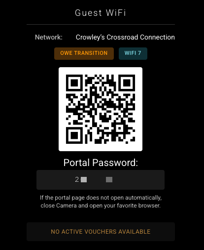
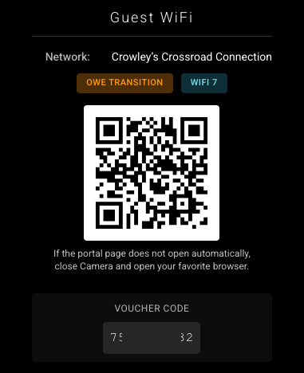

# MMM-UniFiGuestWiFi

A [MagicMirror²](https://github.com/MagicMirrorOrg/MagicMirror) module for
displaying UniFi Hotspot WiFi network details, including SSID, password, QR
code, and available voucher codes.

## Features

- **Multiple Data Sources**: Fetch guest/hotspot WiFi details from UniFi controller
  API or use configuration-based settings
- **Flexible Authentication**: API key first with automatic controller-login
  fallback when credentials are provided
- **WiFi Security Support**: Open, OWE, OWE Transition, WPA, WPA2, and WPA3
  networks
- **WiFi Standard Badge**: Displays WiFi generation badge (WiFi 4/5/6/6E/7)
  when detectable
- **Enhanced WiFi Detection Mode**: Optional AP-capability-based detection to
  improve WiFi 7 classification
- **Backend QR Generation**: Server-side QR image generation for reliable
  rendering on older Electron runtimes
- **Captive Portal Friendly QR**: QR payload joins SSID only (portal password
  is displayed in UI, not embedded in QR)
- **Voucher Integration**: Displays next available active voucher code from
  direct API query
- **Fallback Support**: Shows hotspot portal password when no vouchers are
  available
- **Smooth Refresh Updates**: Display updates in place after initial render
  without flashing the module
- **Password Masking**: Optional password display masking in the UI (for
  protected networks)
- **Responsive Layouts**: Vertical (default) or horizontal layout options
- **Customizable Styling**: QR code size, colors, and display options

## Prerequisites

1. A working MagicMirror² installation
2. For API mode: A UniFi OS console (Cloud Key, UDM, or similar) with Network application
3. For API mode: Local UniFi OS username and password with Network permissions

## Installation

### Option 1: Standard Install (Git)

From your MagicMirror `modules` folder:

```bash
cd MagicMirror/modules
git clone https://github.com/rroach3753/MMM-UniFiGuestWiFi.git
cd MMM-UniFiGuestWiFi
npm install
```

### Option 2: Install with MMPM (MagicMirror Package Manager)

If you use MMPM:

```bash
mmpm install MMM-UniFiGuestWiFi
```

## Configuration

Add this to your `config/config.js` file. See examples below for specific scenarios.

### Basic Structure

```js
{
  module: "MMM-UniFiGuestWiFi",
  position: "top_right",
  config: {
    // Configuration options here
  },
},
```

## Screenshots

### Portal Password Shown (No Vouchers Available)

When there are no active vouchers, the module displays the hotspot portal
password fallback.



### Voucher Available (Portal Password Hidden)

When an active voucher is available, the module shows the next voucher and
hides the portal password fallback.



## Configuration Options

### Data Source Options

| Option | Type | Default | Description |
|--------|------|---------|-------------|
| `authMode` | string | `"config"` | Data source mode: `"config"` (hardcoded), `"api"` (fetch from UniFi using API key or controller login), or `"auto"` (try API, fallback to config) |

### Config Mode Options (authMode: "config")

| Option | Type | Default | Description |
|--------|------|---------|-------------|
| `ssid` | string | `"Guest Network"` | WiFi network name |
| `password` | string | `"guestpass123"` | WiFi password (empty for open networks) |
| `securityType` | string | `"WPA"` | Security type: `"OPEN"`, `"OWE"`, `"OWE_TRANSITION"`, `"WPA"`, `"WPA2"`, or `"WPA3"` |
| `isHidden` | boolean | `false` | Whether the SSID is hidden |

### API Mode Options (authMode: "api")

| Option | Type | Default | Description |
|--------|------|---------|-------------|
| `controllerUrl` | string | `"https://unifi.local"` | UniFi controller URL |
| `apiKey` | string | `""` | UniFi API key (if using API key auth) |
| `apiKeyHeader` | string | `"X-API-Key"` | Header name for API key |
| `username` | string | `""` | UniFi OS username |
| `controllerPassword` | string | `""` | UniFi OS password (preferred field name) |
| `passwordField` | string | `""` | Legacy alias for UniFi OS password (still supported) |
| `site` | string | `"default"` | UniFi site name |
| `verifySSL` | boolean | `true` | Verify SSL certificates (recommended) |
| `requestTimeout` | number | `10000` | HTTP request timeout in milliseconds |
| `refreshInterval` | number | `300000` | Data refresh interval in milliseconds (5 minutes) |
| `enhancedWiFiStandardDetection` | boolean | `true` | Use AP capability data (`stat/device`) to improve WiFi generation badging |

Authentication behavior in API mode:

- If `apiKey` is set, the module tries API key authentication first.
- If API key does not return usable data and `username` + `controllerPassword`
  are set, it falls back to controller login.
- If API key is not set, it uses `username` + `controllerPassword` directly.

WiFi standard detection behavior:

- `enhancedWiFiStandardDetection: true` (default) uses AP capability lookups
  to improve WiFi generation badging.
- Set `enhancedWiFiStandardDetection: false` to use SSID-level data only (more
  conservative classification).

### Display Options

| Option | Type | Default | Description |
|--------|------|---------|-------------|
| `title` | string | `"Guest WiFi"` | Module title |
| `layoutVertical` | boolean | `true` | Display layout: `true` for vertical, `false` for horizontal |
| `showSSID` | boolean | `true` | Show SSID/network name |
| `showPassword` | boolean | `false` | Show password (if applicable) |
| `showSecurityType` | boolean | `true` | Show security type badge |
| `showWiFiStandard` | boolean | `true` | Show WiFi generation badge |
| `showVoucher` | boolean | `true` | Show voucher code section |
| `maskPassword` | boolean | `true` | Mask password display (asterisks/dots) - QR still contains actual password |

### Voucher Options

| Option | Type | Default | Description |
|--------|------|---------|-------------|
| `voucherLabel` | string | `"Guest Code"` | Label for voucher code display |
| `includeHotspotPassword` | boolean | `false` | Show hotspot portal password when no vouchers available |

### QR Code Options

| Option | Type | Default | Description |
|--------|------|---------|-------------|
| `qrSize` | number | `150` | QR code size in pixels (width and height) |
| `colorDark` | string | `"#000000"` | QR code dark color (hex) |
| `colorLight` | string | `"#ffffff"` | QR code light color (hex) |

### Message Options

| Option | Type | Default | Description |
|--------|------|---------|-------------|
| `emptyMessage` | string | `"No guest WiFi configured."` | Message when no WiFi data available |
| `loadingMessage` | string | `"Loading guest WiFi details..."` | Message while loading |
| `noVouchersMessage` | string | `"No active vouchers available"` | Message when no vouchers found |
| `captivePortalHint` | string | `"If the portal page does not open automatically, close Camera and open your favorite browser."` | Hint shown below QR for captive portal onboarding |

## Configuration Examples

### Example 1: Config Mode - WPA Network

```js
{
  module: "MMM-UniFiGuestWiFi",
  position: "top_right",
  config: {
    authMode: "config",
    ssid: "Company Guest Network",
    password: "SecureGuestPass123!",
    securityType: "WPA3",
    isHidden: false,
    title: "Guest WiFi",
    layoutVertical: true,
    maskPassword: false,
    qrSize: 150,
  },
}
```

### Example 2: Config Mode - Open Network

```js
{
  module: "MMM-UniFiGuestWiFi",
  position: "top_right",
  config: {
    authMode: "config",
    ssid: "Public Hotspot",
    password: "", // Empty for open networks
    securityType: "OPEN",
    isHidden: false,
    showPassword: false, // Password field will be hidden
    title: "Free WiFi",
    layoutVertical: true,
  },
}
```

### Example 3: Config Mode - Hidden OWE Network with Password Masking

```js
{
  module: "MMM-UniFiGuestWiFi",
  position: "top_right",
  config: {
    authMode: "config",
    ssid: "Hidden Enterprise",
    password: "EncryptedWithoutPassword",
    securityType: "OWE",
    isHidden: true,
    maskPassword: true, // Password will show as dots
    title: "Enterprise Network",
    layoutVertical: false, // Horizontal layout
  },
}
```

### Example 4: API Mode - Fetch from UniFi Controller

```js
{
  module: "MMM-UniFiGuestWiFi",
  position: "top_right",
  config: {
    authMode: "api",
    controllerUrl: "https://unifi.local",
    username: "admin",
    controllerPassword: "your_unifi_password",
    site: "default",
    verifySSL: true,
    refreshInterval: 300000,
    title: "Guest WiFi",
    showVoucher: true,
    voucherLabel: "Voucher Code",
    includeHotspotPassword: true,
  },
}
```

### Example 5: Auto Mode with Fallback

```js
{
  module: "MMM-UniFiGuestWiFi",
  position: "top_right",
  config: {
    authMode: "auto", // Try API, fall back to config on failure
    controllerUrl: "https://unifi.local",
    username: "admin",
    controllerPassword: "your_unifi_password",
    site: "default",
    verifySSL: true,
    refreshInterval: 300000,
  },
}
```

### Example 6: API Key Only (No Controller Login)

```js
{
  module: "MMM-UniFiGuestWiFi",
  position: "top_right",
  config: {
    authMode: "api",
    controllerUrl: "https://unifi.local",
    apiKey: "YOUR_UNIFI_API_KEY",
    apiKeyHeader: "X-API-Key",
    site: "default",
    verifySSL: true,
    refreshInterval: 300000,
  },
}
```

### Example 7: Controller Username/Password Only

```js
{
  module: "MMM-UniFiGuestWiFi",
  position: "top_right",
  config: {
    authMode: "api",
    controllerUrl: "https://unifi.local",
    username: "admin",
    controllerPassword: "your_unifi_password",
    site: "default",
    verifySSL: true,
    refreshInterval: 300000,
  },
}
```

### Example 8: API Key First, Then Login Fallback

```js
{
  module: "MMM-UniFiGuestWiFi",
  position: "top_right",
  config: {
    authMode: "auto",
    controllerUrl: "https://unifi.local",
    apiKey: "YOUR_UNIFI_API_KEY",
    apiKeyHeader: "X-API-Key",
    username: "admin",
    controllerPassword: "your_unifi_password",
    site: "default",
    verifySSL: true,
    refreshInterval: 300000,
  },
}
```

## WiFi Security Types

### OPEN

- No authentication required
- QR format: `WIFI:T:nopass;S:NetworkName;;`
- Password field not displayed

### OWE (Opportunistic Wireless Encryption)

- Individualized Data Encryption (IDE) without pre-shared key
- QR format: `WIFI:T:OWE;S:NetworkName;;`
- Password field not displayed

### OWE_TRANSITION

- Network configured for both Open and OWE compatibility
- Displayed as `OWE TRANSITION` in the UI badge
- Encoded with open join behavior in QR for compatibility with camera-based
  onboarding
- Password field not displayed

### WPA / WPA2 / WPA3

- Traditional password-protected networks
- Password field displayed (unless masked)

## QR Code Format Details

QR payloads are intentionally captive-portal friendly and encode SSID join metadata only.

Current format:

```text
WIFI:S:{SSID};T:{nopass|OWE};;
```

Notes:
- Portal/voucher passwords are shown in the UI and are not embedded in the QR payload.
- OWE transition networks are encoded for compatibility with camera-based onboarding.
- SSID text is safely escaped for QR payload generation.

## Voucher Code Integration

Voucher data is fetched directly from the UniFi API in API/auto modes. If no active vouchers are available, the module can display:
- The message "No active vouchers available"
- The hotspot portal password (if `includeHotspotPassword: true`)

## Updating

### Standard Update (Git)

From the module folder:

```bash
cd MagicMirror/modules/MMM-UniFiGuestWiFi
git pull
npm install
```

### Update with MMPM

```bash
mmpm update MMM-UniFiGuestWiFi
```

## UniFi API Calls Used

When `authMode` is set to `api` or `auto`, the module detects Hotspot/Guest WiFi networks by trying these endpoints in order (stopping at the first one that returns usable WLAN records):

1. `/proxy/network/api/s/{site}/rest/wlanconf`
2. `/api/s/{site}/rest/wlanconf`
3. `/proxy/network/api/v2/sites/{site}/networks?type=hotspot`
4. `/proxy/network/api/v2/sites/{site}/networks?type=guest`
5. `/api/v2/sites/{site}/networks?type=hotspot`
6. `/api/v2/sites/{site}/networks?type=guest`

Voucher lookup uses:

1. `/proxy/network/api/s/{site}/rest/hotspot/voucher`
2. `/proxy/network/api/s/{site}/stat/voucher`
3. `/api/s/{site}/rest/hotspot/voucher`
4. `/api/s/{site}/stat/voucher`

Hotspot portal settings fallback uses:

1. `/proxy/network/api/s/{site}/get/setting`
2. `/api/s/{site}/get/setting`

Authentication uses session cookies from `POST /api/auth/login` for controller-login mode, with API key support where available.

## Troubleshooting

### QR Code Not Generating

- Ensure dependencies are installed (`npm install`)
- Check MagicMirror logs for backend errors in `node_helper.js`
- Verify controller/API mode can return usable network data

### WiFi Data Not Displaying

**Config Mode:**
- Verify `ssid` and `password` are correctly configured
- Check `securityType` is one of the supported types

**API Mode:**
- Verify controller URL is accessible and uses HTTPS
- Check username and password are correct
- Verify user has Network app permissions
- Check SSL certificate verification setting (`verifySSL`)
- Look for errors in MagicMirror logs

### Special Characters Not Working in QR

- SSID text is escaped automatically before QR generation
- Test the generated QR code with a mobile device
- Some old QR scanners may not support special characters

### Voucher Code Not Displaying

- Verify active vouchers exist in the hotspot portal
- In API mode, verify user has permission to read vouchers
- Check `showVoucher: true` setting

### Password Masking Not Working

- Password masking only applies to WPA/WPA2/WPA3 networks
- Open and OWE networks don't have passwords, so masking has no effect
- QR code always contains the actual password regardless of masking setting

## SSL Certificate Issues

If using a self-signed certificate on your UniFi controller:

```js
config: {
  verifySSL: false, // Disable SSL verification only when you cannot use trusted certs
  requestTimeout: 10000
}
```

For production environments, keep `verifySSL: true` and use a valid SSL certificate.

### Node.js Certificate Chain Issues

If your UniFi controller has a **valid certificate but from a CA that Node.js
doesn't recognize**, you may see failures with `verifySSL: true` even though
the certificate is valid (curl works fine). This is because Node.js has stricter
certificate chain validation than curl.

### Use NODE_EXTRA_CA_CERTS Environment Variable

1. Export your controller's certificate:

```bash
openssl s_client -connect your-controller:8443 -showcerts </dev/null 2>/dev/null \
  | sed -ne '/-BEGIN CERTIFICATE-/,/-END CERTIFICATE-/p' \
  > ~/.config/controller-ca.pem
```

1. Start MagicMirror with the certificate available to Node.js:

```bash
export NODE_EXTRA_CA_CERTS=~/.config/controller-ca.pem
npm start
```

1. Keep `verifySSL: true` in your config — it will now work with proper
   verification enabled.

Alternatively, add this to your shell profile (`.bashrc`, `.zshrc`, etc.) for
a permanent solution:

```bash
export NODE_EXTRA_CA_CERTS=~/.config/controller-ca.pem
```

## Security

Recommended production settings:

```js
config: {
  authMode: "auto", // or "api" / "config" based on your environment
  verifySSL: true,
  requestTimeout: 10000,
  showPassword: false,
  includeHotspotPassword: false,
  maskPassword: true
}
```

Threat model notes:
- Network attacker / MITM: keep `verifySSL: true` to prevent credential and session interception.
- Local shoulder-surfing: hide credentials in UI (`showPassword: false`, `includeHotspotPassword: false`) for public displays.
- Log exposure: avoid debug logging of voucher/password values on shared systems.
- Credential lifecycle: prefer dedicated, least-privilege UniFi accounts and rotate API keys/passwords regularly.
- Recovery behavior: in `auto` mode, verify fallback config is intentional and not a stale backup credential source.

## License

MIT License - see [LICENSE](LICENSE) file for details

## Support

For issues, questions, or suggestions, please visit the repository or create an issue.

## References

- [WiFi QR Code Format Specification](https://github.com/zxing/zxing/wiki/Barcode-Contents#wi-fi-network-config)
- [UniFi Network API Documentation](https://ubntwifi.github.io/unifi-api/)
- [MagicMirror² Documentation](https://docs.magicmirror.builders/)
