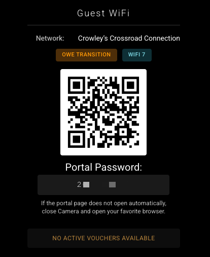
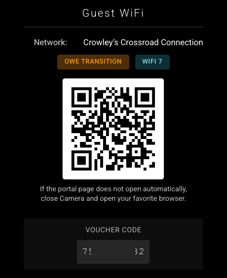

# MMM-UniFiGuestWiFi

A [MagicMirror²](https://github.com/MagicMirrorOrg/MagicMirror) module for
displaying UniFi Hotspot WiFi network details, including SSID, password, QR
code, and available voucher codes.

## Features

- **Multiple Data Sources**: Fetch guest/hotspot WiFi details from UniFi controller
  API or use configuration-based settings
- **Flexible Authentication**: API key first with automatic controller-login
  fallback when credentials are provided
- **WiFi Security Support**: Open, OWE, OWE Transition, WPA, WPA2, and WPA3
  networks
- **WiFi Standard Badge**: Displays WiFi generation badge (WiFi 4/5/6/6E/7)
  when detectable
- **Enhanced WiFi Detection Mode**: Optional AP-capability-based detection to
  improve WiFi 7 classification
- **Backend QR Generation**: Server-side QR image generation for reliable
  rendering on older Electron runtimes
- **Captive Portal Friendly QR**: QR payload joins SSID only (portal password
  is displayed in UI, not embedded in QR)
- **Voucher Integration**: Displays next available active voucher code from
  direct API query
- **Fallback Support**: Shows hotspot portal password when no vouchers are
  available
- **Smooth Refresh Updates**: Display updates in place after initial render
  without flashing the module
- **Password Masking**: Optional password display masking in the UI (for
  protected networks)
- **Responsive Layouts**: Vertical (default) or horizontal layout options
- **Customizable Styling**: QR code size, colors, and display options

## Prerequisites

1. A working MagicMirror² installation
2. For API mode: A UniFi OS console (Cloud Key, UDM, or similar) with Network application
3. For API mode: Local UniFi OS username and password with Network permissions

## Installation

### Option 1: Standard Install (Git)

From your MagicMirror `modules` folder:

```bash
cd MagicMirror/modules
git clone https://github.com/rroach3753/MMM-UniFiGuestWiFi.git
cd MMM-UniFiGuestWiFi
npm install
```

### Option 2: Install with MMPM (MagicMirror Package Manager)

If you use MMPM:

```bash
mmpm install MMM-UniFiGuestWiFi
```

## Configuration

### Basic Config Example (Quick Start)

Add this module block to your MagicMirror `config/config.js` file to get started:

1. Install the module in your `MagicMirror/modules` folder.
2. Add this module block to the modules array in `config/config.js`.
3. Save and restart MagicMirror.

```js
{
  module: "MMM-UniFiGuestWiFi",
  position: "top_right",
  config: {
    ssid: "Guest Network",
    password: "guestpass123",
    securityType: "WPA2"
  }
},
```

Then restart MagicMirror. See examples below for specific scenarios.

## Screenshots

### Portal Password Shown (No Vouchers Available)

When there are no active vouchers, the module displays the hotspot portal
password fallback.



### Voucher Available (Portal Password Hidden)

When an active voucher is available, the module shows the next voucher and
hides the portal password fallback.



## Configuration Options

### Data Source Options

Data-source and controller security policy is configured only in the
MagicMirror server environment. Renderer `config.js` values for `authMode`,
`site`, or `verifySSL` are ignored.

### Config Mode Options (`UNIFI_GUEST_WIFI_AUTH_MODE=config`)

| Option | Type | Default | Description |
|--------|------|---------|-------------|
| `ssid` | string | `"Guest Network"` | WiFi network name |
| `password` | string | `"guestpass123"` | WiFi password (empty for open networks) |
| `securityType` | string | `"WPA"` | Security type: `"OPEN"`, `"OWE"`, `"OWE_TRANSITION"`, `"WPA"`, `"WPA2"`, or `"WPA3"` |
| `isHidden` | boolean | `false` | Whether the SSID is hidden |

### API/Auto Renderer Options

| Option | Type | Default | Description |
|--------|------|---------|-------------|
| `requestTimeout` | number | `10000` | HTTP request timeout in milliseconds |
| `refreshInterval` | number | `300000` | Data refresh interval in milliseconds; finite integers are clamped to 60000–86400000 (1 minute–24 hours) |
| `enhancedWiFiStandardDetection` | boolean | `true` | Use AP capability data (`stat/device`) to improve WiFi generation badging |

Authentication behavior in API mode:

- Data-source mode, site, TLS verification, controller URL, authentication,
  and sensitive disclosure permissions are server-only environment settings.
  Renderer values are ignored and are never authorization.
- If `UNIFI_GUEST_WIFI_API_KEY` is set, the helper tries API key authentication
  first.
- If the API key does not return usable data and
  `UNIFI_GUEST_WIFI_USERNAME` + `UNIFI_GUEST_WIFI_PASSWORD` are set, it falls
  back to controller login.
- `UNIFI_GUEST_WIFI_URL` is required for API mode and is validated as one
  canonical HTTPS origin.

WiFi standard detection behavior:

- `enhancedWiFiStandardDetection: true` (default) uses AP capability lookups
  to improve WiFi generation badging.
- Set `enhancedWiFiStandardDetection: false` to use SSID-level data only (more
  conservative classification).

### Display Options

| Option | Type | Default | Description |
|--------|------|---------|-------------|
| `title` | string | `"Guest WiFi"` | Module title |
| `layoutVertical` | boolean | `true` | Display layout: `true` for vertical, `false` for horizontal |
| `showSSID` | boolean | `true` | Show SSID/network name |
| `showPassword` | boolean | `false` | Show a returned WiFi password; also requires `UNIFI_GUEST_WIFI_ALLOW_WIFI_PASSWORD=true` |
| `showSecurityType` | boolean | `true` | Show security type badge |
| `showWiFiStandard` | boolean | `true` | Show WiFi generation badge |
| `showVoucher` | boolean | `true` | Show voucher code section |
| `maskPassword` | boolean | `true` | Mask password display (asterisks/dots) - QR still contains actual password |

### Voucher Options

| Option | Type | Default | Description |
|--------|------|---------|-------------|
| `voucherLabel` | string | `"Guest Code"` | Label for voucher code display |
| `includeHotspotPassword` | boolean | `false` | Show a returned hotspot password; also requires `UNIFI_GUEST_WIFI_ALLOW_HOTSPOT_PASSWORD=true` |

### QR Code Options

| Option | Type | Default | Description |
|--------|------|---------|-------------|
| `qrSize` | number | `150` | QR code size in pixels (width and height) |
| `colorDark` | string | `"#000000"` | QR code dark color (hex) |
| `colorLight` | string | `"#ffffff"` | QR code light color (hex) |

### Message Options

| Option | Type | Default | Description |
|--------|------|---------|-------------|
| `emptyMessage` | string | `"No guest WiFi configured."` | Message when no WiFi data available |
| `loadingMessage` | string | `"Loading guest WiFi details..."` | Message while loading |
| `noVouchersMessage` | string | `"No active vouchers available"` | Message when no vouchers found |
| `captivePortalHint` | string | `"If the portal page does not open automatically, close Camera and open your favorite browser."` | Hint shown below QR for captive portal onboarding |

## Configuration Examples

### Example 1: Config Mode - WPA Network

```js
{
  module: "MMM-UniFiGuestWiFi",
  position: "top_right",
  config: {
    ssid: "Company Guest Network",
    password: "SecureGuestPass123!",
    securityType: "WPA3",
    isHidden: false,
    title: "Guest WiFi",
    layoutVertical: true,
    maskPassword: false,
    qrSize: 150,
  },
},
```

### Example 2: Config Mode - Open Network

```js
{
  module: "MMM-UniFiGuestWiFi",
  position: "top_right",
  config: {
    ssid: "Public Hotspot",
    password: "", // Empty for open networks
    securityType: "OPEN",
    isHidden: false,
    showPassword: false, // Password field will be hidden
    title: "Free WiFi",
    layoutVertical: true,
  },
},
```

### Example 3: Config Mode - Hidden OWE Network with Password Masking

```js
{
  module: "MMM-UniFiGuestWiFi",
  position: "top_right",
  config: {
    ssid: "Hidden Enterprise",
    password: "EncryptedWithoutPassword",
    securityType: "OWE",
    isHidden: true,
    maskPassword: true, // Password will show as dots
    title: "Enterprise Network",
    layoutVertical: false, // Horizontal layout
  },
},
```

### Example 4: API Mode - Fetch from UniFi Controller

Set the controller origin and credentials in the environment that starts
MagicMirror, then use this renderer configuration:

```bash
export UNIFI_GUEST_WIFI_URL="https://unifi.local"
export UNIFI_GUEST_WIFI_USERNAME="admin"
export UNIFI_GUEST_WIFI_PASSWORD="your_unifi_password"
export UNIFI_GUEST_WIFI_AUTH_MODE="api"
export UNIFI_GUEST_WIFI_SITE="default"
export UNIFI_GUEST_WIFI_ALLOW_VOUCHERS="true"
export UNIFI_GUEST_WIFI_ALLOW_HOTSPOT_PASSWORD="true"
```

```js
{
  module: "MMM-UniFiGuestWiFi",
  position: "top_right",
  config: {
    refreshInterval: 300000,
    title: "Guest WiFi",
    showVoucher: true,
    voucherLabel: "Voucher Code",
    includeHotspotPassword: true,
  },
},
```

### Example 5: Auto Mode with Fallback

Set `UNIFI_GUEST_WIFI_AUTH_MODE=auto` along with the controller environment
settings from Example 4.

```js
{
  module: "MMM-UniFiGuestWiFi",
  position: "top_right",
  config: {
    ssid: "Fallback Guest Network",
    password: "fallback_wifi_password",
    securityType: "WPA2",
    refreshInterval: 300000,
  },
},
```

### Example 6: API Key Only (No Controller Login)

```bash
export UNIFI_GUEST_WIFI_URL="https://unifi.local"
export UNIFI_GUEST_WIFI_API_KEY="YOUR_UNIFI_API_KEY"
export UNIFI_GUEST_WIFI_AUTH_MODE="api"
```

```js
{
  module: "MMM-UniFiGuestWiFi",
  position: "top_right",
  config: {
    refreshInterval: 300000,
  },
},
```

### Example 7: Controller Username/Password Only

Use the environment variables shown in Example 4.

```js
{
  module: "MMM-UniFiGuestWiFi",
  position: "top_right",
  config: {
    refreshInterval: 300000,
  },
},
```

### Example 8: API Key First, Then Login Fallback

```bash
export UNIFI_GUEST_WIFI_URL="https://unifi.local"
export UNIFI_GUEST_WIFI_API_KEY="YOUR_UNIFI_API_KEY"
export UNIFI_GUEST_WIFI_USERNAME="admin"
export UNIFI_GUEST_WIFI_PASSWORD="your_unifi_password"
export UNIFI_GUEST_WIFI_AUTH_MODE="auto"
```

```js
{
  module: "MMM-UniFiGuestWiFi",
  position: "top_right",
  config: {
    refreshInterval: 300000,
  },
},
```

## WiFi Security Types

### OPEN

- No authentication required
- QR format: `WIFI:T:nopass;S:NetworkName;;`
- Password field not displayed

### OWE (Opportunistic Wireless Encryption)

- Individualized Data Encryption (IDE) without pre-shared key
- QR format: `WIFI:T:OWE;S:NetworkName;;`
- Password field not displayed

### OWE_TRANSITION

- Network configured for both Open and OWE compatibility
- Displayed as `OWE TRANSITION` in the UI badge
- Encoded with open join behavior in QR for compatibility with camera-based
  onboarding
- Password field not displayed

### WPA / WPA2 / WPA3

- Traditional password-protected networks
- Password field displayed (unless masked)

## QR Code Format Details

QR payloads are intentionally captive-portal friendly and encode SSID join metadata only.

Current format:

```text
WIFI:S:{SSID};T:{nopass|OWE};;
```

Notes:
- Portal/voucher passwords are shown in the UI and are not embedded in the QR payload.
- OWE transition networks are encoded for compatibility with camera-based onboarding.
- SSID text is safely escaped for QR payload generation.

## Voucher Code Integration

Voucher data is fetched directly from the UniFi API in API/auto modes. If no active vouchers are available, the module can display:
- The message "No active vouchers available"
- The hotspot portal password (if `includeHotspotPassword: true`)

Voucher retrieval requires `UNIFI_GUEST_WIFI_ALLOW_VOUCHERS=true`. Hotspot
password retrieval requires `UNIFI_GUEST_WIFI_ALLOW_HOTSPOT_PASSWORD=true`.
Both permissions default to false because helper responses are broadcast.

## Updating

### Standard Update (Git)

From the module folder:

```bash
cd MagicMirror/modules/MMM-UniFiGuestWiFi
git pull
npm install
```

### Update with MMPM

```bash
mmpm update MMM-UniFiGuestWiFi
```

## UniFi API Calls Used

When `UNIFI_GUEST_WIFI_AUTH_MODE` is `api` or `auto`, the module detects
Hotspot/Guest WiFi networks by trying these endpoints in order (stopping at
the first one that returns usable WLAN records):

1. `/proxy/network/api/s/{site}/rest/wlanconf`
2. `/api/s/{site}/rest/wlanconf`
3. `/proxy/network/api/v2/sites/{site}/networks?type=hotspot`
4. `/proxy/network/api/v2/sites/{site}/networks?type=guest`
5. `/api/v2/sites/{site}/networks?type=hotspot`
6. `/api/v2/sites/{site}/networks?type=guest`

Voucher lookup uses:

1. `/proxy/network/api/s/{site}/rest/hotspot/voucher`
2. `/proxy/network/api/s/{site}/stat/voucher`
3. `/api/s/{site}/rest/hotspot/voucher`
4. `/api/s/{site}/stat/voucher`

Hotspot portal settings fallback uses:

1. `/proxy/network/api/s/{site}/get/setting`
2. `/api/s/{site}/get/setting`

Authentication uses session cookies from `POST /api/auth/login` for controller-login mode, with API key support where available.

## Troubleshooting

### QR Code Not Generating

- Ensure dependencies are installed (`npm install`)
- Check MagicMirror logs for backend errors in `node_helper.js`
- Verify controller/API mode can return usable network data

### WiFi Data Not Displaying

**Config Mode:**
- Verify `ssid` and `password` are correctly configured
- Check `securityType` is one of the supported types

**API Mode:**
- Verify controller URL is accessible and uses HTTPS
- Check username and password are correct
- Verify user has Network app permissions
- Keep `UNIFI_GUEST_WIFI_VERIFY_SSL=true` and configure a trusted certificate
- Look for errors in MagicMirror logs

**Auto Mode (`UNIFI_GUEST_WIFI_AUTH_MODE=auto`):**
- API fetch is attempted first.
- If API fetch fails, auto mode falls back to config-mode values.
- If you do not want fallback behavior, set
  `UNIFI_GUEST_WIFI_AUTH_MODE=api`.
- If you do want fallback behavior, set explicit fallback values for `ssid` and `password` instead of leaving module defaults.

### Special Characters Not Working in QR

- SSID text is escaped automatically before QR generation
- Test the generated QR code with a mobile device
- Some old QR scanners may not support special characters

### Voucher Code Not Displaying

- Verify active vouchers exist in the hotspot portal
- In API mode, verify user has permission to read vouchers
- Set `UNIFI_GUEST_WIFI_ALLOW_VOUCHERS=true` on the server
- Check `showVoucher: true` setting

### Password Masking Not Working

- Password masking only applies to WPA/WPA2/WPA3 networks
- Open and OWE networks don't have passwords, so masking has no effect
- QR code always contains the actual password regardless of masking setting

## SSL Certificate Issues

For production environments, keep `UNIFI_GUEST_WIFI_VERIFY_SSL=true` and use a
valid certificate or `NODE_EXTRA_CA_CERTS`. If verification absolutely must be
disabled, set `UNIFI_GUEST_WIFI_VERIFY_SSL=false` in the MagicMirror process
environment. Renderer `verifySSL` values are ignored.

### Node.js Certificate Chain Issues

If your UniFi controller has a **valid certificate but from a CA that Node.js
doesn't recognize**, you may see failures with TLS verification enabled even though
the certificate is valid (curl works fine). This is because Node.js has stricter
certificate chain validation than curl.

### Use NODE_EXTRA_CA_CERTS Environment Variable

1. Export your controller's certificate:

```bash
openssl s_client -connect your-controller:8443 -showcerts </dev/null 2>/dev/null \
  | sed -ne '/-BEGIN CERTIFICATE-/,/-END CERTIFICATE-/p' \
  > ~/.config/controller-ca.pem
```

1. Start MagicMirror with the certificate available to Node.js:

```bash
export NODE_EXTRA_CA_CERTS=~/.config/controller-ca.pem
npm start
```

1. Keep `UNIFI_GUEST_WIFI_VERIFY_SSL=true` — it will now work with proper
   verification enabled.

Alternatively, add this to your shell profile (`.bashrc`, `.zshrc`, etc.) for
a permanent solution:

```bash
export NODE_EXTRA_CA_CERTS=~/.config/controller-ca.pem
```

## Security

For API/controller mode, set the trusted origin and secrets in the MagicMirror
process environment. They are server-only and must not be placed in `config.js`:

```bash
export UNIFI_GUEST_WIFI_API_KEY="your_api_key"
export UNIFI_GUEST_WIFI_USERNAME="your_username"
export UNIFI_GUEST_WIFI_PASSWORD="your_password"
export UNIFI_GUEST_WIFI_URL="https://unifi.local"
export UNIFI_GUEST_WIFI_AUTH_MODE="api" # config, api, or auto
export UNIFI_GUEST_WIFI_SITE="default"
export UNIFI_GUEST_WIFI_VERIFY_SSL="true"
# Explicit opt-ins; all default to false:
export UNIFI_GUEST_WIFI_ALLOW_WIFI_PASSWORD="false"
export UNIFI_GUEST_WIFI_ALLOW_VOUCHERS="false"
export UNIFI_GUEST_WIFI_ALLOW_HOTSPOT_PASSWORD="false"
# Optional when the controller uses a non-default API key header:
export UNIFI_GUEST_WIFI_API_KEY_HEADER="X-API-Key"
```

The trusted server URL is required in API mode and whenever server-side
credentials are configured. It must be an HTTPS origin without a path,
query, or embedded credentials. `UNIFI_URL`, `UNIFI_API_KEY`,
`UNIFI_API_KEY_HEADER`, `UNIFI_USERNAME`, and `UNIFI_PASSWORD` are supported as
shared fallbacks.

### Migration from renderer policy in config.js

Controller settings in `config.js` are no longer accepted. This prevents a
renderer or socket client from selecting an arbitrary request destination and
keeps controller credentials out of browser memory and socket payloads.

1. Move `authMode` to `UNIFI_GUEST_WIFI_AUTH_MODE` and `site` to
   `UNIFI_GUEST_WIFI_SITE`.
2. Move `controllerUrl` to `UNIFI_GUEST_WIFI_URL`.
3. Move `apiKey` to `UNIFI_GUEST_WIFI_API_KEY`, or move `username` and
   `controllerPassword`/`passwordField` to `UNIFI_GUEST_WIFI_USERNAME` and
   `UNIFI_GUEST_WIFI_PASSWORD`.
4. If needed, move `apiKeyHeader` to
   `UNIFI_GUEST_WIFI_API_KEY_HEADER`.
5. Remove controller and policy fields from the module block and restart the
   entire MagicMirror process so the helper receives the environment.
6. Explicitly opt in to each sensitive value that may be broadcast with the
   matching `UNIFI_GUEST_WIFI_ALLOW_*` variable. Keep all three false unless
   every client connected to the MagicMirror socket may receive those values.

The config-mode `password` remains a WiFi credential, not a controller
credential. It is still sent to the helper in `config`/`auto` mode so backend
QR generation continues to work, but the helper never returns it unless the
server explicitly enables WiFi password disclosure.

Recommended production settings:

```js
config: {
  requestTimeout: 10000,
  showPassword: false,
  includeHotspotPassword: false,
  maskPassword: true
}
```

Threat model notes:
- Socket clients are untrusted: MagicMirror's helper API does not securely
  identify a notification sender, and responses are broadcast. `instanceId`
  is routing metadata only, not authorization.
- Network attacker / MITM: controller origins must use HTTPS; keep
  `UNIFI_GUEST_WIFI_VERIFY_SSL=true` to prevent credential and session
  interception.
- Local shoulder-surfing: hide credentials in UI (`showPassword: false`, `includeHotspotPassword: false`) for public displays.
- Log exposure: avoid debug logging of voucher/password values on shared systems.
- Credential lifecycle: prefer dedicated, least-privilege UniFi accounts and rotate API keys/passwords regularly.
- Recovery behavior: in `auto` mode, verify fallback config is intentional and not a stale backup credential source.

## License

MIT License - see [LICENSE](LICENSE) file for details

## Support

For issues, questions, or suggestions, please visit the repository or create an issue.

## References

- [WiFi QR Code Format Specification](https://github.com/zxing/zxing/wiki/Barcode-Contents#wi-fi-network-config)
- [UniFi Network API Documentation](https://ubntwifi.github.io/unifi-api/)
- [MagicMirror² Documentation](https://docs.magicmirror.builders/)
